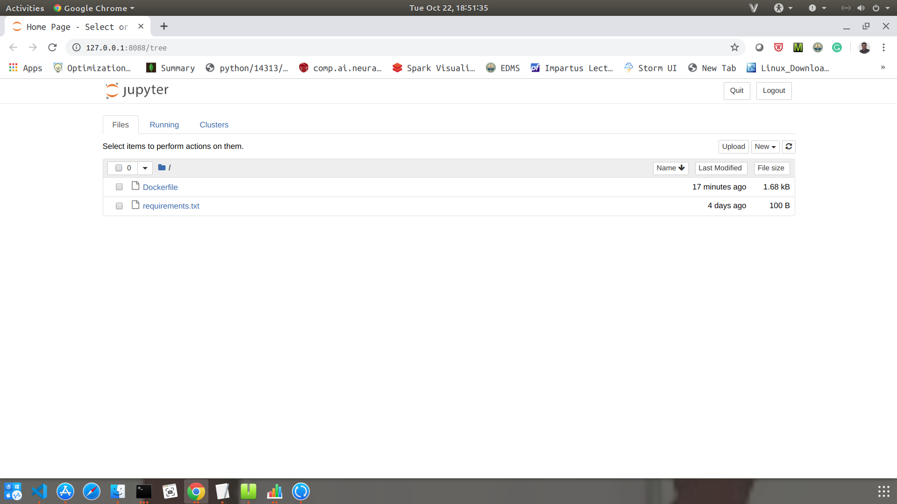

# Spark_Docker_Jupyter

* Download the docker file 
* Use docker run -p 8088:8088 -v <spark files on the system >:<file_path on docker> spark
* Running this command will give us a url to open the juptyer notebook which we need to paste on the browser
  
* This will give the jupyter notebook home as shown below

